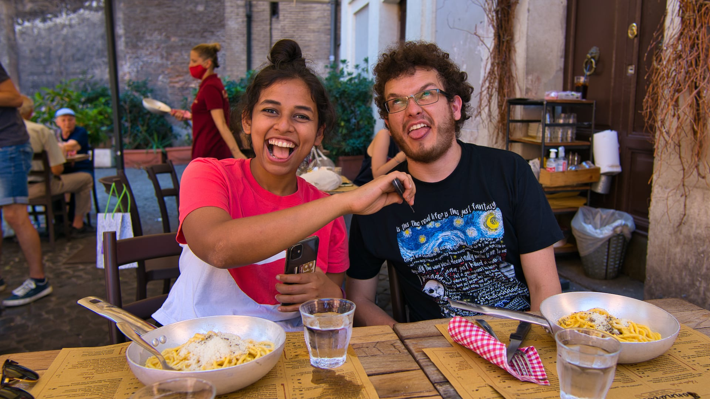

A little bit outside of Rome's main touristic center, across River Tiber, there is a neighborhood called Trastevere.
Although Romans in general are exceptionally proud of their culinary culture, in Trastevere is where you'll find many of the oldest and most authentic restaurants in the Italian capital.

Trastevere, much like most of Rome's attractions, is still very much within walking distance of the Colosseum and the Pantheon, but you can also get there easily via bus or tram.
The walk is recommended, however, as you can enjoy a nice view of the river from Ponte Garibaldi.
In true Italian fashion, the streets are narrow and pictoresque, often making you feel transported in time to simpler times.

Our destination was Ristorante Tonnarello, which is said to make the best pasta alla carbonara in Rome.
Carbonara itself is one of the most famous and traditional dishes of Roman cuisine.
Although widely adapted around the world, the authentic sauce is made with very few ingredients: egg yolks, pecorino romano cheese, black pepper and guanciale, a kind of bacon from the pork's cheek.

Complimenting this simple and delicious sauce is Tonnarello's fresh pasta, itself called tonnarelli, which is not to be confused with spaghetti or other long pasta shapes.
With its thick and square shape, this pasta can also be found under the name chitarra, which is very traditional in abruzzese cuisine.

Tonnarello is where we learned to appreciate the value of fresh pasta.
Soft and chewy define the feeling of eating it, and Tonnarello manages to prepare a carbonara sauce that perfecly coats the pasta, without leaving anything too wet or too dry.
An abundance of cheese and guanciale also guarantee maximum flavor in every bite.

Perhaps the most impressive aspect of Tonnarello, however, is the price.
At only 9€, this fantastic dish is well within Italian standards for a pasta dish, and is even cheaper than other Roman restaurants closer to the main turistic destinations.

We must also remember that Tonnarello was one of the places that inspired us to start writing this blog.

Which ingredients to use in carbonara is a controversial discussion, and one can argue that authenticity is not equivalent to excellence.
However, if you wish to understand the Italian point of view in this debate, you must not pass on the oportunity of tasting freshly made carbonara in Trastevere. 